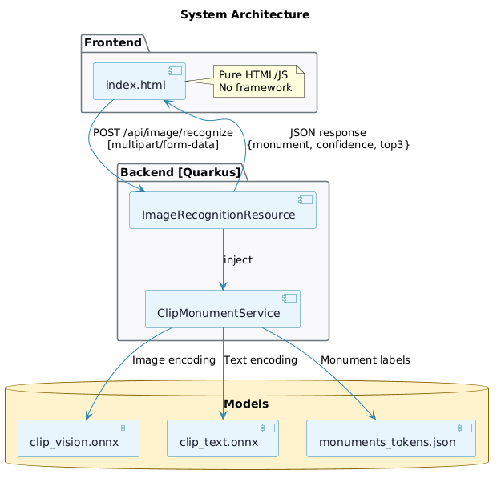

# AI Monument Recognition (Mostly in Europe) 

### The First Fully Local AI Monument Detection System

> **100% Local AI** — No cloud. No API keys. No data leaves your machine.

A pioneering approach to monument recognition in Europe mostly powered by **local AI inference**. Run state-of-the-art CLIP neural networks directly on your machine. Your images stay private, your data stays yours.


---

## Quick Start

### Windows

**1. Install Visual Studio Build Tools (required for Rust):**

Download and install from: https://visualstudio.microsoft.com/visual-cpp-build-tools/

Or run in PowerShell:
```powershell
winget install Microsoft.VisualStudio.2022.BuildTools
```
Then open the installer and select **"Desktop development with C++"**.

**2. Install Rust:**
```powershell
winget install Rustlang.Rustup
```
**Restart your terminal after installation.**

**3. Install Java 21:**
```powershell
winget install Microsoft.OpenJDK.21
```

**4. Run:**
```batch
.\run.bat
```

---

### macOS

**1. Install Xcode Command Line Tools (required for Rust):**
```bash
xcode-select --install
```

**2. Install Rust:**
```bash
curl --proto '=https' --tlsv1.2 -sSf https://sh.rustup.rs | sh
source $HOME/.cargo/env
```

**3. Install Java 21:**
```bash
brew install openjdk@21
```

**4. Run:**
```bash
chmod +x run.sh
./run.sh
```

---

### Linux

**1. Install build essentials (required for Rust):**
```bash
# Ubuntu/Debian
sudo apt install build-essential

# Fedora
sudo dnf groupinstall "Development Tools"

# Arch
sudo pacman -S base-devel
```

**2. Install Rust:**
```bash
curl --proto '=https' --tlsv1.2 -sSf https://sh.rustup.rs | sh
source $HOME/.cargo/env
```

**3. Install Java 21:**
```bash
# Ubuntu/Debian
sudo apt install openjdk-21-jdk

# Fedora
sudo dnf install java-21-openjdk

# Arch
sudo pacman -S jdk21-openjdk
```

**4. Run:**
```bash
chmod +x run.sh
./run.sh
```

---

### Controls

| Key | Action                |
|-----|-----------------------|
| `O` | Open image file       |
| `R` | Recognize monument    |
| `Q` | Quit                  |

---

## Local AI Architecture



---

## Key Features

| Feature                  | Description                                           |
|--------------------------|-------------------------------------------------------|
|  **Local AI**          | AI runs 100% on your machine — no cloud required      |
|  **Privacy First**     | Your images never leave your computer                 |
|  **Fast Local Inference** | ONNX Runtime optimized for local AI speed          |
|  **No API Keys**       | Zero external dependencies or subscriptions           |
|  **CLIP Neural Network** | State-of-the-art vision-language AI model           |

---

## Requirements

| Dependency | Version | Purpose                    |
|------------|---------|----------------------------|
| Java       | 21+     | Backend runtime            |
| Rust       | 1.75+   | TUI frontend               |
| Maven      | 3.8+    | Build tool (included)      |

---

## Project Structure

```
OneEuroTrip/
|
+-- backend/                          [Quarkus REST API]
|   +-- src/main/java/com/myapp/
|   |   +-- resources/
|   |   |   +-- ImageRecognitionResource.java
|   |   +-- services/
|   |       +-- ClipMonumentService.java
|   +-- src/main/resources/
|       +-- clip_vision.onnx          [Vision encoder model]
|       +-- clip_text.onnx            [Text encoder model]
|       +-- monuments_tokens.json     [Monument label tokens]
|
+-- frontend/                         [Rust Ratatui TUI]
|   +-- Cargo.toml
|   +-- src/
|       +-- main.rs
|
+-- run.bat                           [Windows launcher]
+-- run.sh                            [Unix launcher]
+-- README.md
```

---

## API Reference

### POST /api/image/recognize

Analyze an uploaded image and identify the monument.

**Request**

| Parameter | Type        | Description          |
|-----------|-------------|----------------------|
| file      | File        | Image file (JPG/PNG) |

**Response**

```json
{
  "monument": "Eiffel Tower",
  "city": "Paris",
  "country": "France",
  "confidence": 0.95,
  "top5": [
    { "monument": "Eiffel Tower", "city": "Paris", "country": "France", "confidence": 0.95 },
    { "monument": "Arc de Triomphe", "city": "Paris", "country": "France", "confidence": 0.02 },
    { "monument": "Statue of Liberty", "city": "New York", "country": "USA", "confidence": 0.01 },
    { "monument": "Big Ben", "city": "London", "country": "UK", "confidence": 0.01 },
    { "monument": "Colosseum", "city": "Rome", "country": "Italy", "confidence": 0.01 }
  ]
}
```

---

## Technology Stack

| Layer      | Technology      | Purpose                          |
|------------|-----------------|----------------------------------|
| Frontend   | Rust + Ratatui  | Terminal user interface          |
| Backend    | Quarkus         | REST API framework               |
| Runtime    | ONNX Runtime    | Neural network inference         |
| Model      | CLIP            | Vision-language understanding    |
| Language   | Java 21 + Rust  | Backend + Frontend               |

---

## Manual Start

If you prefer to run components separately:

**Terminal 1 - Backend:**
```bash
cd backend
./mvnw quarkus:dev      # Linux/macOS
mvnw.cmd quarkus:dev    # Windows
```

**Terminal 2 - Frontend:**
```bash
cd frontend
cargo run --release
```

---

## Troubleshooting

### Windows: `link.exe not found` or `could not compile`

This means Visual Studio Build Tools are not installed.

**Solution:**
1. Download: https://visualstudio.microsoft.com/visual-cpp-build-tools/
2. Run the installer
3. Select **"Desktop development with C++"**
4. Click Install
5. **Restart your terminal**
6. Run `.\run.bat` again

### Windows: `cargo not recognized`

Rust PATH is not set.

**Solution:**
1. Close and reopen your terminal
2. Or run: `$env:Path = "$env:USERPROFILE\.cargo\bin;$env:Path"`

### All platforms: Backend fails to start

Port 8080 may be in use.

**Solution:**
```bash
# Windows
taskkill /F /IM java.exe

# Linux/macOS
pkill -f quarkus
```

### All platforms: Connection refused

Backend is not running.

**Solution:**
Make sure to start the backend first:
```bash
cd backend
./mvnw quarkus:dev    # Linux/macOS
mvnw.cmd quarkus:dev  # Windows
```

---

## Useful Links

### Frontend
- [Rust Documentation](https://doc.rust-lang.org/book/)
- [Ratatui (TUI Framework)](https://ratatui.rs/)
- [Crossterm (Terminal Library)](https://docs.rs/crossterm/latest/crossterm/)

### Backend
- [Java 21 Documentation](https://docs.oracle.com/en/java/javase/21/)
- [Quarkus Framework](https://quarkus.io/guides/)
- [ONNX Runtime](https://onnxruntime.ai/docs/)

### AI Model
- [OpenAI CLIP](https://github.com/openai/CLIP)
- [CLIP Paper](https://arxiv.org/abs/2103.00020)

---

## License

MIT License
